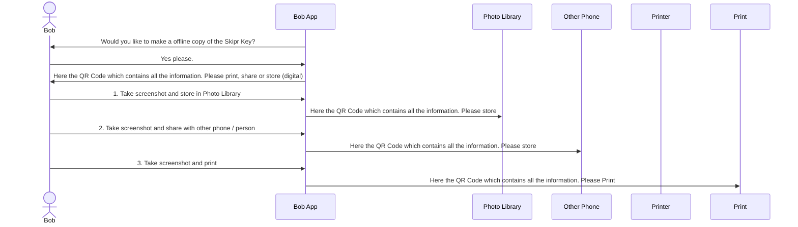
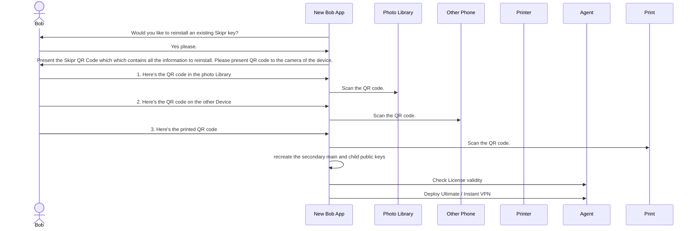

### License data structure in Skipr Chain

The JSON data structure is as follows:

```
{
    "public_key_license_holder": <public_key_2>,
    "public_key_license_provider": "IP",
    "approved_device_id":"unique_generated_key",
    "expiration_timestamp": <timestamp>,
}
```
- `IP` means "Individual Purchase".
- we do not need to record the license activation date as the time recorded in the blockchain transaction does that.

For Bob, original license purchaser[^3]:
```
{
    "public_key_license_holder": <bob_public_key_2>,
    "public_key_license_provider": "IP",
    "approved_device_id":"unique_generated_key",
    "expiration_timestamp": <timestamp>,
}
```

For Alice, child license user[^3], [^4], [^5]:
```
{
    "public_key_license_holder": <alice_public_key_2>,
    "public_key_license_provider": <bob_public_key_2>,
    "approved_device_id":"unique_generated_key",
    "expiration_timestamp": <timestamp>,
}
```

To revoke a child license the parent user app (the one with the `IP` license) can request to cancel the license in the app which will result in a blockchain transaction that adds the following record to the chain:
```
{
    "public_key_license_holder": <alice_public_key_2>,
    "public_key_license_provider": <bob_public_key_2>,
    "approved_device_id":"unique_generated_key",
    "expiration_timestamp": <NOW_timestamp>,
}
```

This means that the license is expired from now onwards.

### License types
Today we will only have the "IP" (="Individual Purchase") license holder (and the package license holder, indicated by the "IP" public key in the field.  Towards the future we might add other types of "parent license holders"
    - `ORCH` - Orchestrator internal license specifically to deploy instant VPN termination points. 
    - `ENT100` - 100 Enterprise licenses
    - `ENT250` - 250 Enterprise licenses
    - etc etc.

[^3]: Alice cannot give license to other people, because she does not have the "IP" (="Individual Purchase") license holder marker.
[^4]: child license validity period is copied from the parent license validity record. To invalidate a child license a new entry will be made in the Skipr's chain with a `license_validity` equal to zero.  For compilation of the latest set of package license keys all entries with the latest chain transaction timestamps will be used (but full history will be maintained).
[^5]: child license validity period is copied from the parent license validity record.

## Private Key offphone storage

In the [diagram](#keys-used) you can see that the private key is the starting point for everything that follows in Skipr.  Therefore to survive a device failure, loss of access to the device we will have to provide a way for users to safely store their private key and recover the private key (and all derivatives) in an easy and safe way.

The private key is in essence a long string of alphanumeric characters.  This can be represented in a QR code as follows:


This QR code presents the `private key` and a unique device identification[^6] code.  What needs to be researched is if the private key allows for public key 1 to be regenerated such that public key 1 is exactly the same as the original.  This is important as public key 1 is the template for the IPv6 address generation.  If not (if public key is the result of a random key generator) then the public key 1 needs to be stored offline (QR code) as well.

[^6]: We need to store a unique device ID to make sure that customer are not enabling multiple devices at once using the same parent license.  Thoughts are: 
    - MAC address. Is WiFi mac address, can be configured by used, therefore is not unique to the device.  
    - For IOS you have the `identifierForVendor: UUID?`. An alphanumeric string that uniquely identifies a device to the app’s vendor. 
    - There is the app store / Google play store id
    - The other (2) public keys can be generated from the `private key`.
    - https://android-developers.googleblog.com/2010/07/licensing-service-for-android.html  
  
We can now offer (standard phone) functionality to print, share or store this image on a different medium than the phone itself.  Every device OS support sharing, printing and storing off_device.  It is also important that this remains to be in the hands of the user, to fulfill the requirements of Skipr not having and storing personal information.



## Private Key off-phone retrieval

In the event a phone gets lost or breaks the user has to be able to re-install the Skipr app (and get it working / operational) without requiring Skipr's intervention. This is where the saved [QR code](#private-key-offphone-storage) is needed.  IT does not matter in which format the QR code has been stored as long as it can be presented to the camera of the device on which the license needs to be re-installed.



## License renewal

The skipr licensed is stored in the skipr chain with the following data:
```
{
    "public_key_license_holder": <bob_public_key_2>,
    "public_key_license_provider": "IP",
    "approved_device_id":"uniquie_generated_key",
    "expiration_timestamp": <timestamp>,
}
```
The timestamp of the transaction (smart contract execution) marks the starting time of the license.  The end time of the license is calculated as follows:
```
transaction_time + license_validity = license_expiration_time
```
All of these times are in seconds (from epoch).  For license renewal a new transaction is being done in skipr's chain which has a more recent transaction time.  The datablock / transaction with the most recent timestamp is considered to be the latest license

## Skipr Chain

1. We use Polygon public network (MATIC) for the storage of the transaction records.
2. We use client P2P IP Address to generate IP Address hash. 
3. Smart contract that can receive calls with parameters (public_key_license_holder, public_key_license_provider, approved_device_id, expiration_timestamp) (Or should we use ProductID instead of ExpirationDate?)
4. When user connects from new, we create a record with new IPAddressHash and invalidation of the previous record (Blockchain record with public_key_license_holder, public_key_license_provider, approved_device_id, expiration_timestamp (now)).
5. We use https://dashboard.alchemy.com/ or https://blastapi.io/ or similar popular public node with free API tier for the initial period as API endpoint.
6. LicenseServer generates private & first public key on initialisation and stores copy of first public key to our vault storage as "permitted writer"
7. LicenseServer uses vault storage "permitted writers" table as a source of verification transactions from which sender are considered valid for the licensing verification
8. Agents and LicenseServer communication happen via P2P network.
9. License Server uses Redis database as a cache to store license records using user first public key as a redis primary key.
10. License Server scans blockchain and fills out all cache on initialisation and then just updates it when new license appears.
11. All license verification requests are going to cache only and not waiting for blockchain.
12. Once a week a job is started to compare validity of cache data/reflush data from blockchain. 
